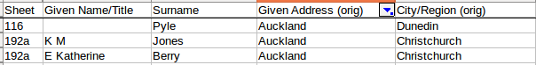

# Suffrage in New Zealand

In 1893, New Zealand became the first self-governing nation in the world to grant voting rights to women. This occurred only after many years of organisation by activists, foremost among them Kate Sheppard and the Woman's Christian Temperance Union.

From the 1880s onwards, many suffrage petitions were presented to parliament. The petitions of 1892 and 1893 have (mostly) survived, and datasets of the signees are available.

**Note** - at present, this repo is just a storehouse for the cleaned-up datasets. A project using them will follow.

## Contents of page

1. [Datasets](#datasets)
2. [Data cleaning](#data-cleaning)
3. [More about the 1893 petitions](#more-about-the-1893-petitions)

## Datasets

### The 1892 petitions

In 1892, eight petitions totalling over 19,000 signatures were presented to parliament.  
A spreadsheet containing data from the 1892 petition(s) has been made available by MCH [here](https://nzhistory.govt.nz/files/documents/1892-womens-suffrage-petition.xls).

### The 1893 petitions

Archives NZ have made the 1893 petition data available in spreadsheet form [here](http://archives.govt.nz/open-data).

## Data cleaning

I performed a lot of correction & cleanup on the 1892 and 1893 datasets linked above to produce the cleaned-up datasets live in [`data/`](./data).

The 1892 dataset is already in very nice shape, so this one was not too strenuous. I did some light data cleaning re: mismatched town/suburb & locality pairings, and also added districts/regions to the spreadsheet, which meant looking up the territorial authorities for a lot of places.

However, the 1893 dataset was extremely messy, and it needed a lot of work.

Locations were the main issue. The original dataset had columns for both _Given Address_ - as written on the original sheets - and _City/Region_. The _City/Region_ values were presumably added according to the main locality of the sheet. (The physical sheets don't contain headings or anything to denote the region, but their archival records have usually been named with a region - [for example](https://www.archway.archives.govt.nz/ViewFullItem.do?code=24946323&digital=yes), sheet 259 is 'Region: Waikuku, Woodend').

I was initially very happy to see this column, thinking that it would cut my work down considerably in mapping signatures by district/region. Unfortunately, there were frequent inaccuracies. It wasn't uncommon to see signees who, say, gave their address as Dunedin but were assigned a region of Christchurch. For example, these three women gave addresses of Auckland, but had conflicting regions:

 

Here's the latter signee's original signature v. the region of the sheet:

 

In cases like this, the women apparently signed the petition in places other than which they lived.  

Anyway, all of this led to a lot of data-combing on my part. I also wanted to have a greater specificity in the signees' locality, so I added columns for _Locality_, _Territorial Authority_ (i.e., District), and _Region_. _Locality_ was based on the original _City/Region_ column, but with plenty of clean-ups, due to the aforementioned inaccuracies, but also the fact that I wanted to break down the locations to be more specific (also looking at the Given Address). However, I'm sure I didn't catch everything - and using the _City/Region_ column as the basis for my _Locality_ column will probably have led to some lingering misclassifications.

**Note**: In some cases, no given address was listed. For some of these, the dataset still listed a _City/Region_, so in those cases I just accepted that.

In my amended dataset, a signees' locality is given across the columns _Locality_, _Territorial Authority_ , and _Region_. Where applicable, the locality is the suburb name. For example:

Locality | Territorial Authority | Region
--- | --- | ---
Te Aroha | Matamata-Piako | Waikato
Caversham | Dunedin | Otago

In many cases, the given address was more specific than just the town/suburb, so that's in the mix too. For example:

Given Address| Locality | Territorial Authority | Region
--- | --- | --- | ---
Karangahape Road | Auckland Central | Auckland | Auckland
Torridge Street	| Oamaru | Waitaki	| Otago
Arthur St North East Valley	|	North East Valley	| Dunedin	| Otago

Thank goodness for OpenRefine! It was incredibly useful for normalising place names and addresses. Cluster and Edit was hugely helpful.

Of course, I probably made mistakes in the process, too, but I think I've left the dataset in a lot better shape than I found it.

## More about the 1893 petitions

Thirteen suffrage petitions circulated in 1893, of which only the largest (the Carpenter petition; 23952 signatures) survives. Not much is known about the smaller petitions, which are likely to have been compiled in specific regions. When the petitions were presented to parliament in August 1893, it was recorded that they contained the signatures of 31,872 women, almost a quarter of the voting age Pakeha female population of New Zealand. (See [_About the Petition_](https://nzhistory.govt.nz/politics/womens-suffrage/about-the-petition)).

The Carpenter petition is held by [Archives NZ](http://archives.govt.nz/womens-suffrage-petition) ([Archway record](https://www.archway.archives.govt.nz/ViewEntity.do?code=25903)), and is on display at the National Library of New Zealand, as part of the [He Tohu](https://natlib.govt.nz/he-tohu) exhibition. The petition has been inscribed on [UNESCO's Memory of the World Register](http://www.unesco.org/new/en/communication-and-information/flagship-project-activities/memory-of-the-world/register/full-list-of-registered-heritage/registered-heritage-page-8/the-1893-womens-suffrage-petition/#c183688) since 1997.

As well as the Archives NZ dataset linked above, a searchable database of signees to the Carpenter petition is available at MCH's [NZ History](https://nzhistory.govt.nz/politics/womens-suffrage/petition) website.
