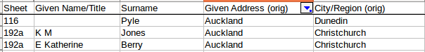
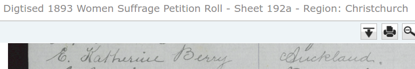
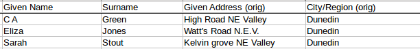
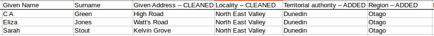
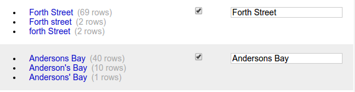

## Data cleaning

The cleaned-up datasets can be found in [`data/`](../data).

### 1892 dataset

The 1892 dataset was already in very nice shape, so this one was not too strenuous. I did some light data cleaning re: mismatched town/suburb & locality pairings, and also added districts/regions to the spreadsheet, which meant looking up the territorial authorities for a lot of places.

### 1893 dataset

The 1893 dataset was extremely messy, and it needed a lot of work.

Locations were the main issue. The original dataset had columns for both _Given Address_ - as written on the original sheets - and _City/Region_. The _City/Region_ values were presumably added according to the main locality of the sheet. (The physical sheets don't contain headings or anything to denote the region, but their archival records have usually been named with a region - [for example](https://www.archway.archives.govt.nz/ViewFullItem.do?code=24946323&digital=yes), sheet 259 is 'Region: Waikuku, Woodend').

I was initially very happy to see this column, thinking that it would cut my work down considerably in mapping signatures by district/region. Unfortunately, there were frequent inaccuracies. It wasn't uncommon to see signees who, say, gave their address as Dunedin but were assigned a region of Christchurch. For example, these three women gave addresses of Auckland, but signed on sheets associated with a different region:

 

Here's the latter signee's original signature v. the region of the sheet.

 

In cases like this, the women evidently signed the petition in places other than which they lived.  

Anyway, all of this led to a lot of data-combing on my part. I also wanted to have a greater specificity in the signees' locality, so I added columns for _Locality_, _Territorial Authority_ (i.e., District), and _Region_. Where applicable, the locality is the suburb name.

Here's how my cleaned address data looks:

Given Address | Locality | Territorial Authority | Region
--- | --- | --- | ---
Te Aroha | Te Aroha | Matamata-Piako | Waikato
Karangahape Road | Auckland Central | Auckland | Auckland
Torridge Street	| Oamaru | Waitaki	| Otago
Caversham | Caversham | Dunedin | Otago
Arthur St North East Valley	|	North East Valley	| Dunedin	| Otago

_Locality_ was based on the original _City/Region_ column, but with plenty of clean-ups, due to the aforementioned inaccuracies, but also the fact that I wanted to break down the locations to be more specific (by also looking at the Given Address). However, I'm sure I didn't catch everything - and using the _City/Region_ column as the basis for my _Locality_ column will probably have led to some lingering misclassifications.

Here's an example. Before:

And after:

**Note**: In some cases, no given address was listed. For some of these, the dataset still listed a _City/Region_, so in those cases I just accepted that.

Thank goodness for OpenRefine! It was incredibly useful for normalising place names and addresses. Cluster and Edit was hugely helpful.

Another thing I did was to pull out titles (Miss, Mrs, etc) into a separate column, via a bunch of regexing and text filtering.

Of course, I may have introduced some errors of my own in the whole data cleaning process, but I definitely removed many more errors in regard to erroneous regions.
